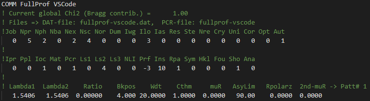
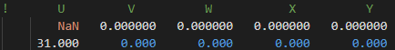
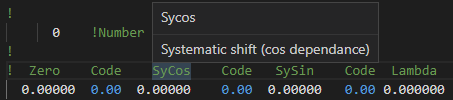

# fullprof-vscode README

FullProf VSCode bring support to Visual Studio Code for FullProf pcr files (`.pcr` and `.new`) in order to make it easier viewing and working with.

## Features

All the following features are available in `fullprof-vscode`

### Syntax highlight

The screenshots were made using default Visual Studio Code dark theme, colors can be different with a custom theme.

#### Comments

Comments are separated from numerical values

#### Numerical value highlight

Refinable paramaters code stand out from refined values. Error like `NaN` are also highlighted.

#### FullProf Documentation

The documentation is not activated at launch, in order to access it, do the following procedure :
1. Open the command palette `Ctrl+Shift+P`  
2. Then type `FullProf in VSCode`

The documentation is now available by hovering the parameter in the comment line.

## Known Issues

- Missing documentation for some parameters.
- Refinable parameters may not be all highlighted.

## Release Notes

### 1.0.0

Initial release of `fullprof-vscode`

-----------------------------------------------------------------------------------------------------------
